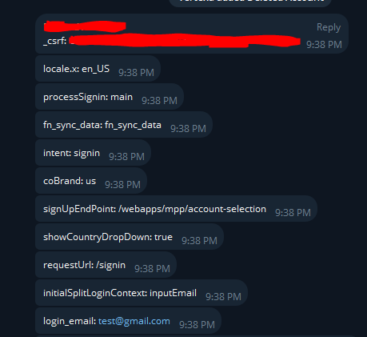

# MrChrome
Mr. Chrome is a versatile Python-based browser replacement that enables advanced web activity tracking, input field monitoring, and real-time Telegram notifications, making it ideal for web scraping, testing, and remote monitoring



This is a Python script that interacts with the Chrome browser using Selenium and sends data to a Telegram chat. It can be used for various web automation tasks. Below, you'll find instructions on how to install, run, and configure this script.

## Table of Contents

- [Installation](#installation)
- [How to Run](#how-to-run)
- [FAQ](#faq)
- [Examples](#examples)

## Installation

1. Clone the repository to your local machine.

   ```bash
   git clone https://github.com/vibheksoni/MrChrome.git
   cd MrChrome
   ```

2. Install the required Python libraries using pip.

   ```bash
   pip install undetected-chromedriver selenium webdriver-manager requests
   ```

3. Open the script and configure the following variables:

   - `bot_token`: Your Telegram bot token.
   - `chat_id`: Your Telegram chat ID (e.g., `-4232223`).

## How to Run

Run the script using Python:

```bash
python chrome_bot.py
```

The script will start a socket server and a Chrome browser instance. It will listen for incoming connections and send data to your Telegram chat.

## FAQ

### Q: What does this script do?

A: This script automates interactions with the Chrome browser and sends data to a specified Telegram chat. It can be used for various web automation tasks.

### Q: How do I obtain a Telegram bot token and chat ID?

A: You can create a Telegram bot and obtain a bot token by talking to the [BotFather](https://core.telegram.org/bots#botfather) on Telegram. To find your chat ID, you can use services like [this one](https://telegram.me/getidsbot).

### Q: How do I configure which websites to interact with?

A: This is a manual process goto the function handler_thread and look at the current example6

### Q: Can I run this script on Linux/Windows/macOS?

A: Yes, this script is compatible with Windows, Linux, and macOS only for graphical capabilities.

Feel free to customize and extend the script for your own automation tasks. If you have any questions or need further assistance, please refer to the FAQ section or create an issue in this repository.
